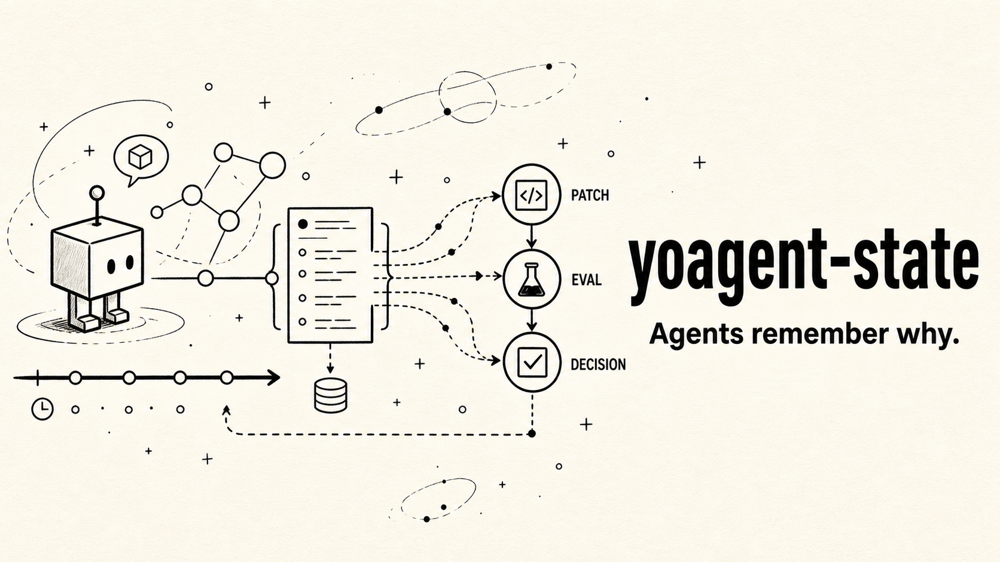

# yoagent-state

Durable memory and lineage for long-running agents.



Agents do not just need logs. They need to remember what failed, what changed, what tested it, who approved it, and why the current project state exists.

`yoagent-state` is an ActiveGraph-inspired Rust continuity runtime for agent systems. It records append-only events, replays them into a semantic graph, and gives you primitives for goals, tasks, observations, hypotheses, patches, artifacts, evals, decisions, policies, behaviors, replay, and forks.

It helps answer the questions that matter after an agent run:

- Why does this patch exist?
- What failure did it address?
- What eval validated it?
- What files or artifacts did it reference?
- Was it approved, rejected, or promoted?

```text
goal -> task -> run -> observation -> failure -> hypothesis -> patch -> artifact -> eval -> decision -> promotion
```

```text
yoagent executes.
yoagent-state remembers.
yoyo evolve improves.
```

## Start in 60 seconds

```bash
git clone https://github.com/yologdev/yoagent-state.git
cd yoagent-state
cargo run --example patch_eval_decision
```

You should see a lineage report like this:

```text
# Persist retry state across timeout

- id: patch_42
- kind: patch
- status: Promoted

## Artifacts
- git.diff: file://.yoyo/artifacts/patch_42.diff

## Outgoing
- addresses -> failure_17
- validated_by -> eval_55
- approved_by -> decision_9
```

This means `patch_42` was promoted, references a Git diff artifact, addresses `failure_17`, was validated by `eval_55`, and was approved by `decision_9`.

Run the full test suite:

```bash
cargo test
```

Try local JSONL persistence:

```bash
cargo run --bin yoagent-state -- init
cargo run --bin yoagent-state -- graph
YOAGENT_STATE_EVENTS=.yoyo/state/events.jsonl cargo run --bin yoagent-state -- events
```

## What it does

`yoagent-state` gives long-running agents durable continuity without taking over your project.

- Records append-only events for goals, runs, tools, failures, patches, evals, decisions, and artifacts.
- Replays events into a small semantic graph projection.
- Tracks patch lifecycle from proposal to approval, rejection, or promotion.
- References real project artifacts such as diffs, commits, logs, eval output, and files.
- Supports typed packs, policy gates, behavior subscriptions, replay, fork, and diff primitives.
- Exposes lineage queries so agents and humans can explain why state exists.

Git still owns concrete project changes. `yoagent-state` stores why those changes happened, what tested them, and what they mean.

## When you need this

Use `yoagent-state` when:

- your agent runs longer than one prompt
- you need to explain why a code change exists
- you want eval and decision history attached to patches
- you want durable state without adopting a workflow engine or graph database
- you are building on `yoagent`, `yoyo evolve`, or another Rust agent loop

You probably do not need it for one-off scripts, stateless chat flows, or projects where Git commit messages already capture enough context.

## Minimal Rust example

```rust
use serde_json::json;
use yoagent_state::{ActorRef, MemoryEventStore, NodeId, StateOp, YoAgentState};

#[tokio::main]
async fn main() -> Result<(), Box<dyn std::error::Error>> {
    let state = YoAgentState::load(MemoryEventStore::new()).await?;
    let failure = NodeId::new("failure_1");

    state.apply_ops(
        ActorRef::agent("demo"),
        vec![StateOp::CreateNode {
            id: failure.clone(),
            kind: "failure".to_string(),
            props: json!({ "title": "retry state lost after timeout" }),
        }],
    ).await?;

    print!("{}", state.lineage(failure).await.to_markdown());
    Ok(())
}
```

## What it is not

`yoagent-state` is intentionally small.

- not a replacement for Git
- not a workflow engine
- not a graph database
- not a full project database
- not a universal agent framework
- not a hidden self-modification system

The motto is simple but effective.

## Documentation

Hosted docs:

```text
https://yologdev.github.io/yoagent-state/
```

Run the mdBook locally:

```bash
mdbook serve docs
```

If `mdbook` is not installed:

```bash
cargo install mdbook
```

If Cargo's binary directory is not on your `PATH`, run it directly:

```bash
~/.cargo/bin/mdbook serve docs
```

GitHub Pages is deployed by `.github/workflows/docs.yml`. In the GitHub repo settings, Pages source should be set to **GitHub Actions**.

## For coding agents

Read [AGENTS.md](./AGENTS.md) before modifying the repo. It explains the project boundary, core files, test commands, and the simple-but-effective design rule.

## Roadmap

The future plan is tracked in [ROADMAP.md](./ROADMAP.md) and mirrored in the mdBook guide.

## Acknowledgments

The core idea for `yoagent-state` comes from [Yohei Nakajima](https://github.com/yoheinakajima) and his [ActiveGraph](https://github.com/yoheinakajima/activegraph) work. This project is an independent Rust implementation inspired by that idea, intentionally kept smaller in scope for `yoagent` and `yoyo evolve`. See [ACKNOWLEDGMENTS.md](./ACKNOWLEDGMENTS.md).

## License

Licensed under the [MIT license](./LICENSE).
