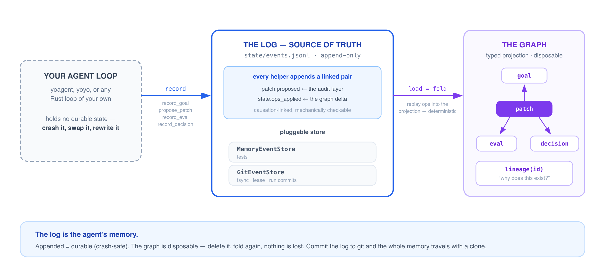
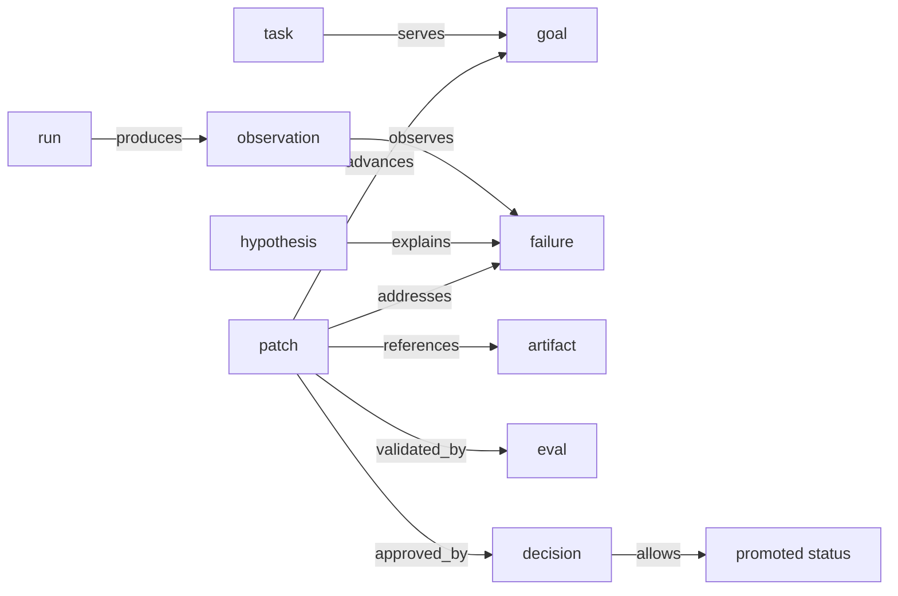

<div align="center">


**Durable state and lineage for long-running agents.**

[crates.io](https://crates.io/crates/yoagent-state) · [API Docs](https://docs.rs/yoagent-state) · [Guide](https://yologdev.github.io/yoagent-state/) · [GASP — the protocol](https://gasp.yolog.dev) · [Examples](examples/)

[](https://crates.io/crates/yoagent-state)
[](https://docs.rs/yoagent-state)
[](Cargo.toml)
[](LICENSE)

</div>

---

## The log is the agent's memory

Agents do not just need logs. They need to remember what failed, what changed, what tested it, who approved it, and why the current state exists.

`yoagent-state` is a small, ActiveGraph-inspired Rust continuity runtime built on one rule: **durable state is an append-only event log; everything else is a projection.** Your loop records semantic events — goals, runs, patches, evals, decisions. The log is the only thing persisted. Replaying (*folding*) it rebuilds a typed graph, deterministically. Kill the process and fold again — nothing is lost. Commit the log to git and clone it elsewhere — the agent's whole memory travels with it.



Three properties fall out of that one rule:

- **Crash-safe** — an event appended is a fact remembered; `GitEventStore` flushes and fsyncs per event, so a crash mid-run loses nothing already recorded.
- **Explainable** — `lineage(id)` answers *"why does this patch exist?"* as a graph walk: the failure it addresses, the eval that validated it, the decision that approved it.
- **Portable** — the log is plain JSONL in a git repo; the executor is swappable. This is the substrate the [GASP protocol](https://gasp.yolog.dev) standardizes.

```text
yoagent executes.
yoagent-state remembers.
yoyo evolve improves.
```

## The causal spine

```text
goal -> task -> run -> observation -> failure -> hypothesis -> patch -> artifact -> eval -> decision -> promotion
```

That line is the common causal spine, not a required linear workflow. A diff is an artifact. Promotion is a patch status transition backed by evals and decisions.



## Start in 60 seconds

Add the crate:

```bash
cargo add yoagent-state
```

Run the demo from a local clone:

```bash
git clone https://github.com/yologdev/yoagent-state.git
cd yoagent-state
cargo run --example goal_lineage
```

You should see a lineage report like this:

```text
# Make retry behavior reliable

- id: goal_retry_reliability
- kind: goal
- status: InProgress

## Incoming
- serves <- task_retry_timeout
- blocks <- failure_retry_timeout
- advances <- patch_retry_state
```

The goal is being served by a task, blocked by a failure, and advanced by a patch — and the graph can prove it, because every edge came from a recorded event.

More lanes to explore:

```bash
cargo run --example patch_eval_decision   # the promotion ratchet
cargo run --example replay_and_fork       # time travel over the log
cargo test                                # the full suite
```

## Minimal Rust example

```rust
use serde_json::json;
use yoagent_state::{ActorRef, MemoryEventStore, NodeId, StateOp, YoAgentState};

#[tokio::main]
async fn main() -> Result<(), Box<dyn std::error::Error>> {
    let state = YoAgentState::load(MemoryEventStore::new()).await?;
    let failure = NodeId::new("failure_1");

    state.apply_ops(
        ActorRef::agent("demo"),
        vec![StateOp::CreateNode {
            id: failure.clone(),
            kind: "failure".to_string(),
            props: json!({ "title": "retry state lost after timeout" }),
        }],
    ).await?;

    print!("{}", state.lineage(failure).await.to_markdown());
    Ok(())
}
```

In real use you rarely touch `apply_ops` directly — the typed helpers (`record_goal`, `record_run_started`, `propose_patch`, `record_eval`, `record_decision_node`, …) emit each domain event **and** its graph delta as a causation-linked pair, so the audit layer and the folded graph can never silently diverge.

## Git-native persistence — emit a GASP agent repo

`GitEventStore` turns the log into a *portable agent*: durable per-event appends, a single-writer lease checked inside the append path, and one boundary commit per run with `Run-Id` / `Goal` / `Outcome` trailers — so `git log` reads as a list of runs.

```rust
use yoagent_state::{ActorRef, Goal, GoalId, RunId, YoAgentState, init_agent_repo};

let store = init_agent_repo("./my-agent", "my-agent", "worker-1")?;
let state = YoAgentState::load(store.clone()).await?;
let actor = ActorRef::agent("demo");

state.record_goal(Goal::new(
    GoalId::new("goal_retry"),
    "Make retry reliable",
    "retries drop state after timeout",
    actor.clone(),
)).await?;
state.record_run_started(actor.clone(), RunId::new("run_1"), "fix retry skill").await?;
// ... propose_patch, record_eval, record_decision_node ...
store.commit_run(&RunId::new("run_1"), &GoalId::new("goal_retry"), "promoted", &[])?;
```

The result is a repo any [GASP](https://gasp.yolog.dev)-conformant runtime can restore with clone + fold. Try the full round trip:

```bash
cargo run --example gasp_agent_repo -- /tmp/gasp-demo-repo
# then verify it with the GASP conformance checker (all 7 checks):
#   github.com/yologdev/gasp → cargo run -q -- /tmp/gasp-demo-repo
```

`yoagent-state` is the reference runtime of the **GASP protocol** (the Git Agent State Protocol — "the repo is the agent"). It runs in production as the persistence layer of [yoyo](https://github.com/yologdev/yoyo-evolve), the self-evolving agent, whose live state repo is [yoyo-gasp](https://github.com/yologdev/yoyo-gasp).

## What it does

- Records append-only events for goals, tasks, runs, observations, model calls, tool calls, failures, hypotheses, patches, evals, decisions, and artifacts.
- Replays events into a small semantic graph projection — deterministically.
- Tracks goal/task lineage and the patch lifecycle from proposal to approval, rejection, or promotion.
- References real project artifacts: diffs, commits, logs, eval output, files.
- Supports typed packs, policy gates, behavior subscriptions, replay, fork, and diff primitives.
- Exposes lineage queries so agents and humans can explain why state exists.

Git still owns concrete project changes. `yoagent-state` stores *why* those changes happened, what tested them, and what they mean.

## When you need this

Use `yoagent-state` when:

- your agent runs longer than one prompt
- you need to explain why a code change exists
- you want eval and decision history attached to patches
- you want durable state without adopting a workflow engine or graph database
- you are building on `yoagent`, `yoyo evolve`, or another Rust agent loop

You probably do not need it for one-off scripts, stateless chat flows, or projects where Git commit messages already capture enough context.

## What it is not

`yoagent-state` is intentionally small.

- not a replacement for Git
- not a workflow engine
- not a graph database
- not a full project database
- not a universal agent framework
- not a hidden self-modification system

The motto is simple but effective.

## Ecosystem

| Project | Role |
|---|---|
| **yoagent-state** (this crate) | the runtime — record, fold, query |
| [gasp](https://github.com/yologdev/gasp) | the protocol — spec, canonical fixture, conformance checker |
| [yoyo-evolve](https://github.com/yologdev/yoyo-evolve) | the reference agent — a self-evolving coding agent built on this stack |
| [yoyo-gasp](https://github.com/yologdev/yoyo-gasp) | a living agent repo — yoyo's portable state, growing autonomously |

## Documentation

Hosted guide: [yologdev.github.io/yoagent-state](https://yologdev.github.io/yoagent-state/) · API reference: [docs.rs/yoagent-state](https://docs.rs/yoagent-state)

Run the mdBook locally:

```bash
cargo install mdbook   # if not installed
mdbook serve docs      # or ~/.cargo/bin/mdbook serve docs
```

GitHub Pages is deployed by `.github/workflows/docs.yml`. In the GitHub repo settings, Pages source should be set to **GitHub Actions**.

## For coding agents

Read [AGENTS.md](./AGENTS.md) before modifying the repo. It explains the project boundary, core files, test commands, and the simple-but-effective design rule.

## Roadmap

The future plan is tracked in [ROADMAP.md](./ROADMAP.md) and mirrored in the mdBook guide.

## Acknowledgments

The core idea for `yoagent-state` comes from [Yohei Nakajima](https://github.com/yoheinakajima) and his [ActiveGraph](https://github.com/yoheinakajima/activegraph) work. This project is an independent Rust implementation inspired by that idea, with a Rust-first architecture for `yoagent` and `yoyo evolve`. See [ACKNOWLEDGMENTS.md](./ACKNOWLEDGMENTS.md).

## License

Licensed under the [MIT license](./LICENSE).
