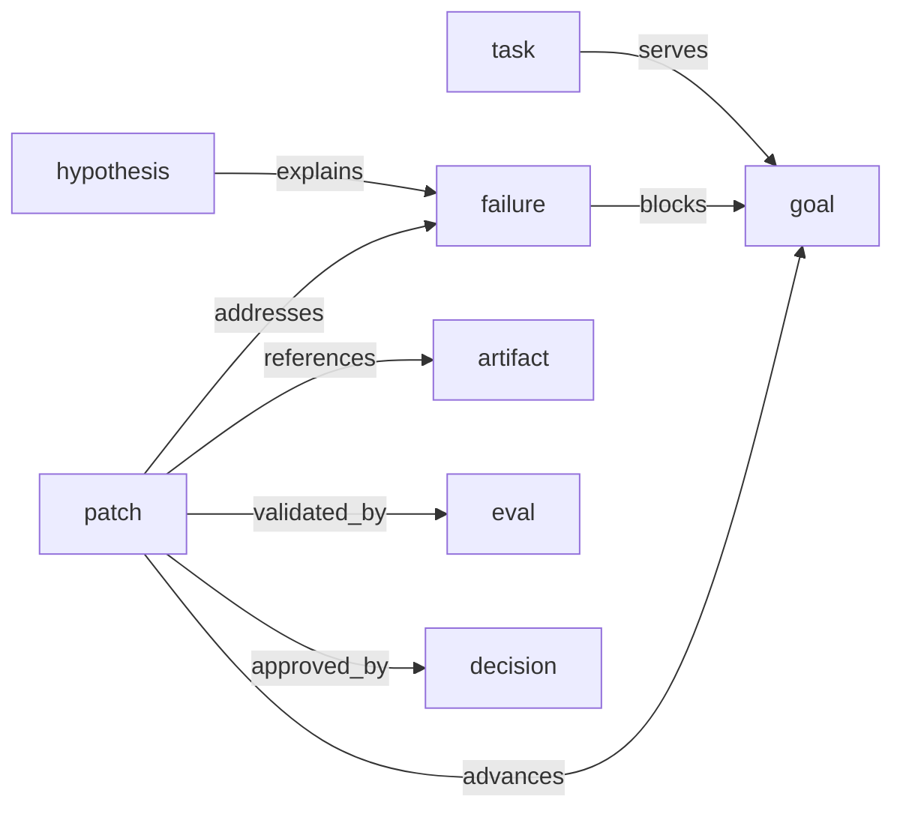

# API Guide

This page shows the common tasks you perform with `yoagent-state`.

The current API is organized around this goal-centered graph shape:

```text
goal -> task -> run -> observation -> failure -> hypothesis -> patch -> artifact -> eval -> decision -> promotion
```



You can use only the pieces you need. The graph does not require every flow to create every node.

## Create state in memory

Use memory state for tests, examples, and short-lived runs:

```rust
let state = YoAgentState::load(MemoryEventStore::new()).await?;
```

## Create persisted state

Use JSONL when state should survive process restart:

```rust
let state = YoAgentState::load(
    JsonlEventStore::new(".yoagent-state/events.jsonl")
).await?;
```

`YoAgentState::load` scans the event store and replays events into the graph projection.

## Record a failure

```rust
state.record_failure(
    ActorRef::agent("yoyo-evolve"),
    NodeId::new("failure_17"),
    "tool_retry_survives_timeout fails",
    "Retry state is lost when timeout cancels the future.",
).await?;
```

Use failures for concrete observed problems, not vague concerns.

## Record a goal

```rust
let goal = Goal::new(
    GoalId::new("goal_retry_reliability"),
    "Make retry behavior reliable",
    "Retry attempts should survive timeout cancellation.",
    ActorRef::agent("yoyo-evolve"),
);

state.record_goal(goal).await?;
```

Goals are the top of the common lineage graph.

## Record a task

```rust
let task = Task {
    id: TaskId::new("task_retry_timeout"),
    title: "Fix timeout retry state".to_string(),
    summary: "Investigate and patch retry state loss.".to_string(),
    status: TaskStatus::InProgress,
    goal: Some(GoalId::new("goal_retry_reliability")),
    created_by: ActorRef::agent("yoyo-evolve"),
    metadata: serde_json::json!({}),
};

state.record_task(task).await?;
```

Tasks link to goals with `serves`.

## Record observations and hypotheses

```rust
let observation = Observation {
    id: ObservationId::new("observation_retry_log"),
    title: "Retry attempt reset observed".to_string(),
    summary: "The second attempt starts from zero after timeout.".to_string(),
    observed_in: None,
    metadata: serde_json::json!({}),
};

state.record_observation(actor.clone(), observation).await?;
```

```rust
let hypothesis = Hypothesis {
    id: HypothesisId::new("hypothesis_cancelled_future"),
    title: "Attempt count is scoped to cancelled future".to_string(),
    summary: "The retry state is dropped when the future is cancelled.".to_string(),
    confidence: Some(0.8),
    metadata: serde_json::json!({}),
};

state
    .record_hypothesis(actor, hypothesis, Some(NodeId::new("failure_17")))
    .await?;
```

## Apply low-level state ops

Use `apply_ops` when you want direct control over nodes and relations:

```rust
state.apply_ops(
    ActorRef::agent("demo"),
    vec![StateOp::CreateNode {
        id: NodeId::new("failure_1"),
        kind: "failure".to_string(),
        props: serde_json::json!({ "title": "retry failed" }),
    }],
).await?;
```

This writes a `state.ops_applied` event and updates the graph projection.

## Propose a patch

```rust
let mut patch = StatePatch::new(
    PatchId::new("patch_42"),
    "Persist retry state across timeout",
    "Keep attempt count outside the cancelled future.",
    ActorRef::agent("yoyo-evolve"),
);

patch.evidence.push(NodeId::new("failure_17"));
patch.expected_effects.push(ExpectedEffect::TestPasses {
    name: "tool_retry_survives_timeout".to_string(),
});

state.propose_patch(patch).await?;
```

Patch evidence becomes lineage.

## Attach an artifact

```rust
let artifact = ArtifactRef::new(
    "git.diff",
    "file://.yoyo/artifacts/patch_42.diff",
).with_summary("Fix retry persistence and add timeout regression test");

state.attach_artifact(NodeId::new("patch_42"), artifact).await?;
```

Artifacts should point to concrete external evidence such as diffs, commits, files, logs, or eval reports.

## Record an eval result

```rust
state.record_eval_result(
    ActorRef::agent("yoyo-evolve"),
    NodeId::new("eval_55"),
    PatchId::new("patch_42"),
    "cargo test tool_retry_survives_timeout",
    true,
).await?;
```

This creates an eval node and a `validated_by` relation from the patch to the eval.

## Record a decision

```rust
state.record_decision(
    ActorRef::user("yuanhao"),
    NodeId::new("decision_9"),
    PatchId::new("patch_42"),
    true,
    "Eval passed; approve promotion",
).await?;
```

Approved decisions create `approved_by` relations. Rejected decisions create `rejected_by` relations.

## Update patch status

```rust
state.update_patch_status(
    PatchId::new("patch_42"),
    PatchStatus::Promoted,
    Some("Promoted as commit def456".to_string()),
).await?;
```

Status is stored on the patch node and also recorded as a historical event.

## Query lineage

```rust
let lineage = state.lineage(NodeId::new("patch_42")).await;
println!("{}", lineage.to_markdown());
```

Use lineage when you want to answer why a node exists and what it is connected to.

## Query related entities

```rust
let patches = state.patches_for_failure(NodeId::new("failure_17")).await;
let evals = state.evals_for_patch(PatchId::new("patch_42")).await;
```

These helpers are intentionally narrow and practical.

## Use the runtime layer

`YoAgentRuntime` adds typed packs, behaviors, and policies:

```rust
let state = YoAgentState::load(MemoryEventStore::new()).await?;
let mut runtime = YoAgentRuntime::new(state.clone());
```

Register a typed pack:

```rust
runtime.register_pack(
    Pack::new(PackId::new("pack_lineage"), "lineage", "0.1.0")
        .add_object_type(ObjectType::new("goal").require("title"))
        .add_object_type(ObjectType::new("task").require("title"))
        .add_relation_type(
            RelationType::new("serves")
                .from_kind("task")
                .to_kind("goal"),
        ),
);
```

Register a policy:

```rust
runtime.register_policy(Policy::require_approval(
    PolicyId::new("policy_create_node_review"),
    "Creating graph nodes requires review",
    PolicyAction::CreateNode,
));
```

Fork and diff:

```rust
let fork = state
    .fork_at_event(ForkId::new("fork_before_task"), Some(event_id))
    .await?;

let diff = diff_graphs(&fork.graph, &state.graph().await);
```
