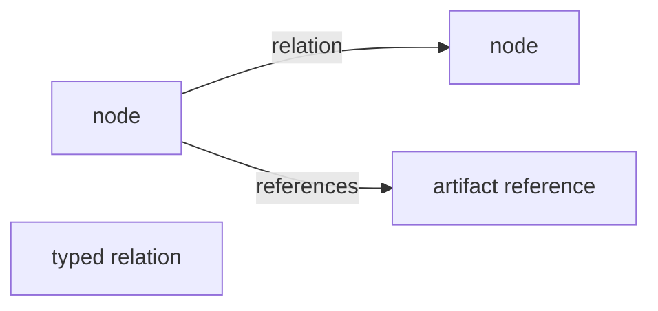

# Concepts

## Event

An event is an immutable fact about something that happened. Events are append-only JSON records with an ID, timestamp, actor, kind, payload, and optional causation or correlation metadata.

Common event kinds:

- `run.started`
- `run.finished`
- `model.called`
- `tool.finished`
- `failure.observed`
- `patch.proposed`
- `patch.status_changed`
- `artifact.attached`
- `state.ops_applied`

Only `state.ops_applied` mutates the graph projection directly.

```mermaid
flowchart LR
  event["event"]
  ops["state.ops_applied"]
  graph["graph projection"]
  history["historical event only"]

  event --> history
  ops --> graph
```

## Graph

The graph is a lossy semantic projection derived from events. It contains nodes, typed relations, artifacts, and a monotonically increasing version.

Keep the graph focused on agent continuity. Do not mirror every AST node, every log line, or every file.



## Node

A node is a semantic object such as a project, run, failure, hypothesis, patch, eval, decision, artifact, file, or task.

## Relation

A relation is a typed edge between two nodes. Useful relation names include:

- `addresses`
- `explains`
- `validated_by`
- `approved_by`
- `rejected_by`
- `modifies`
- `references`
- `derived_from`

## Artifact

Artifacts reference external evidence: diffs, commits, logs, eval JSON, generated reports, model output, or tool output. Store paths, URIs, and hashes where possible.
