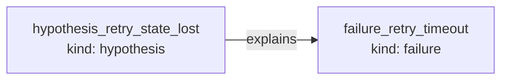
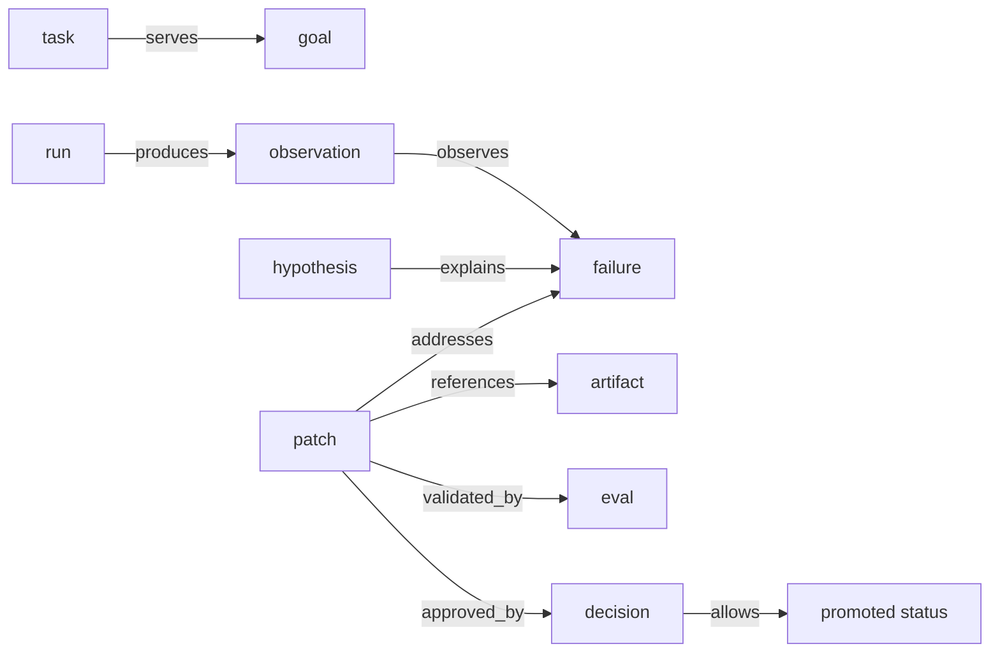

# First Lineage Example

The smallest useful graph is a failure explained by a hypothesis.

Run:

```bash
cargo run --example basic_lineage
```

Expected shape:

```text
# Attempt count is scoped to the cancelled future

- id: hypothesis_retry_state_lost
- kind: hypothesis
- status: unknown

## Outgoing
- explains -> failure_retry_timeout
```

## What this demonstrates

The example creates two nodes:

- a `failure` node
- a `hypothesis` node

Then it creates a relation:

```text
hypothesis_retry_state_lost --explains--> failure_retry_timeout
```



That edge is the start of lineage. Instead of storing a loose note in a transcript, the state layer records a queryable relationship.

## Why it matters

Long-running agents need to preserve small facts like this. A later patch can address the failure, reference the hypothesis as evidence, and attach eval results.

The chain grows naturally:

```text
goal -> task -> run -> observation -> failure -> hypothesis -> patch -> artifact -> eval -> decision -> promotion
```



For this tiny example, only the `hypothesis -> failure` edge is created. The larger runtime can later connect that edge back to a goal and forward to a patch, artifacts, evals, and decisions.

Use this pattern whenever an agent observes something and forms a belief that should survive beyond the current run.
