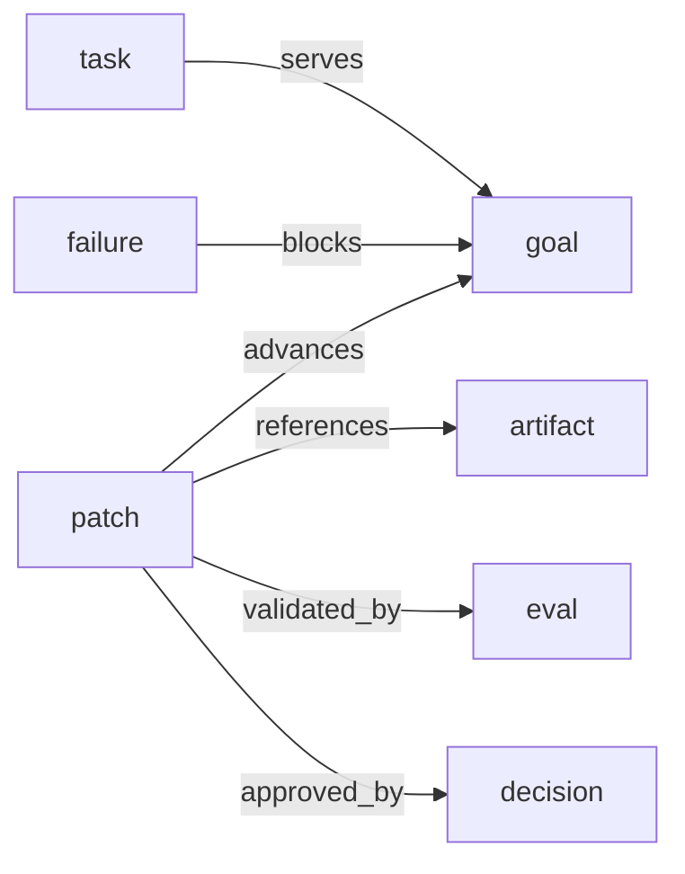

# For Agents

This page is for coding agents and LLMs working in this repo.

Read the root `AGENTS.md` first. This page mirrors the most important guidance in the hosted docs.

## Project boundary

```text
yoagent = execution
yoagent-state = state, lineage, patches, evals, decisions
yoyo evolve = growth loop using both
```

Do not turn this crate into a workflow engine, graph database, Git replacement, compiler, or universal memory system.

## Where to look

- `src/event.rs`: append-only event shape
- `src/patch.rs`: state ops, patches, statuses, preconditions, effects
- `src/graph.rs`: graph projection data structures
- `src/projector.rs`: event replay into graph
- `src/state.rs`: high-level public API
- `src/store.rs`: memory and JSONL event stores
- `src/primitives.rs`: goal/task/observation/hypothesis/eval/decision/frame types
- `src/runtime.rs`: typed packs, policies, approvals, and behaviors
- `src/schema.rs`: pack schemas and relation validation
- `src/policy.rs`: policy gates and approval requests
- `src/behavior.rs`: event-pattern behavior subscriptions
- `src/fork.rs`: replay fork and graph diff helpers
- `examples/`: runnable usage flows
- `tests/`: regression coverage

## Commands

```bash
cargo test
/Users/yuanhao/.cargo/bin/mdbook build docs
cargo run --example goal_lineage
cargo run --example patch_eval_decision
```

## Design rule

Prefer boring, explicit state over clever machinery.

When adding behavior, preserve the goal-centered graph spine:

```text
goal -> task -> run -> observation -> failure -> hypothesis -> patch -> artifact -> eval -> decision -> promotion
```



This is not a mandatory linear workflow. It is the common causal shape that lets a later agent answer what goal was being served, what happened, what changed, what evidence existed, and who or what approved the result.

When in doubt, store meaning and references. Let Git and the filesystem store concrete project state.
