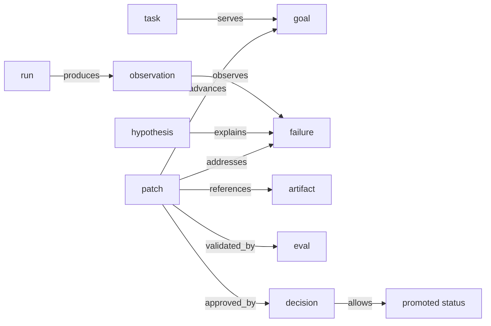

# Introduction

Agents forget why work happened.

They may leave behind chat transcripts, tool logs, test output, and Git diffs, but those artifacts rarely answer the question a maintainer asks later:

```text
Why does this state exist?
```

`yoagent-state` is a small Rust continuity layer for long-running agents. It records durable state and lineage for agent work without replacing the agent loop, Git, the filesystem, CI, or a project database.

The full continuity chain starts from a goal:

```text
goal -> task -> run -> observation -> failure -> hypothesis -> patch -> artifact -> eval -> decision -> promotion
```



That chain is the product. It tells you what the agent was trying to achieve, what work it started, what happened during the run, what failed, what the agent believed, what it proposed, what project artifact it referenced, what tested it, and what decision approved or rejected it.

It is a causal spine, not a required single linked list. Some runs start at a failure, some start at a goal, and some only record tool or model calls. The important part is that the graph can connect intent, execution, evidence, change, and decision.

A diff is usually one of those artifacts. The graph can also attach test logs, model transcripts, screenshots, benchmark output, review notes, or any other evidence an agent needs to explain the work later.

Promotion is represented as a patch status transition. The promotion should be backed by eval and decision lineage, not hidden inside a commit message.

## What yoagent-state does

`yoagent-state` gives agents and humans a durable explanation layer:

- append-only events record what happened
- a graph projection turns events into queryable semantic state
- patches connect failures, evidence, artifacts, evals, and decisions
- lineage reports explain why a node exists
- JSONL persistence lets state survive process restart

The implementation is intentionally boring: Rust structs, JSON payloads, append-only storage, and an in-memory graph projection.

## The boundary

Keep the boundary sharp:

```text
Git stores what changed.
yoagent-state stores why it changed, what tested it, and what it means.
```

`yoagent-state` is not a replacement for Git, a workflow engine, or a graph database. It is the continuity layer that sits beside an agent loop and records the meaning of the work.

## Who it is for

Use it if you are building:

- long-running agents
- agentic coding loops
- eval-driven project improvement systems
- tools that need patch/eval/decision lineage
- `yoagent` or `yoyo evolve` integrations

Start with the [Quick Start](./getting-started.md) to see the main lineage flow in under a minute.
