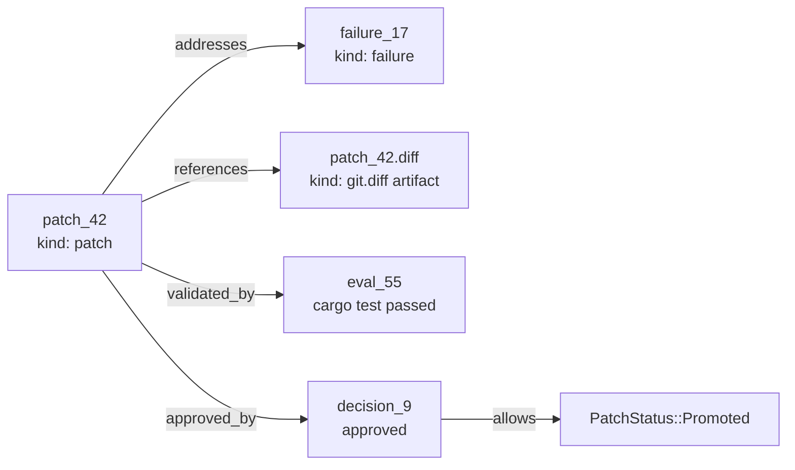

# Patch, Eval, Decision Tutorial

This tutorial walks through the main `yoagent-state` flow:

```text
failure -> patch -> diff artifact -> eval -> decision -> promotion
```



This is the patch lifecycle lane inside the larger goal-centered graph:

```text
goal -> task -> run -> observation -> failure -> hypothesis -> patch -> artifact -> eval -> decision -> promotion
```

Run:

```bash
cargo run --example patch_eval_decision
```

## Step 1: Record a failure

The example records a concrete failure:

```text
failure_17: tool_retry_survives_timeout fails
```

The failure node explains what went wrong:

```text
Retry state is lost when timeout cancels the future.
```

## Step 2: Propose a patch

The patch is not just a title. It carries intent, evidence, preconditions, expected effects, and artifacts.

In the example:

- patch id: `patch_42`
- title: `Persist retry state across timeout`
- evidence: `failure_17`
- precondition: `tool_retry_survives_timeout` is still failing
- expected effect: `tool_retry_survives_timeout` passes

## Step 3: Attach a diff artifact

Concrete project changes stay outside `yoagent-state`.

The patch references a fake Git diff artifact:

```text
file://.yoyo/artifacts/patch_42.diff
```

This keeps the boundary clear:

```text
Git stores what changed.
yoagent-state stores why it changed.
```

## Step 4: Record an eval

The example records:

```text
eval_55: cargo test tool_retry_survives_timeout passed
```

Then it creates the relation:

```text
patch_42 --validated_by--> eval_55
```

## Step 5: Record a decision

The example records a human approval decision:

```text
decision_9: Eval passed; approve promotion
```

Then it creates:

```text
patch_42 --approved_by--> decision_9
```

## Step 6: Promote the patch

Finally, the patch status becomes `Promoted`.

The resulting lineage report shows:

```text
patch_42
status: Promoted
addresses: failure_17
validated_by: eval_55
approved_by: decision_9
```

That is the core product: not just an event log, but a durable explanation.
