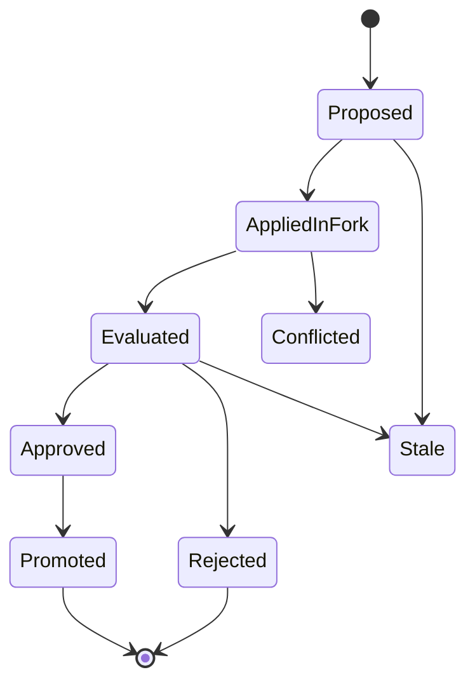
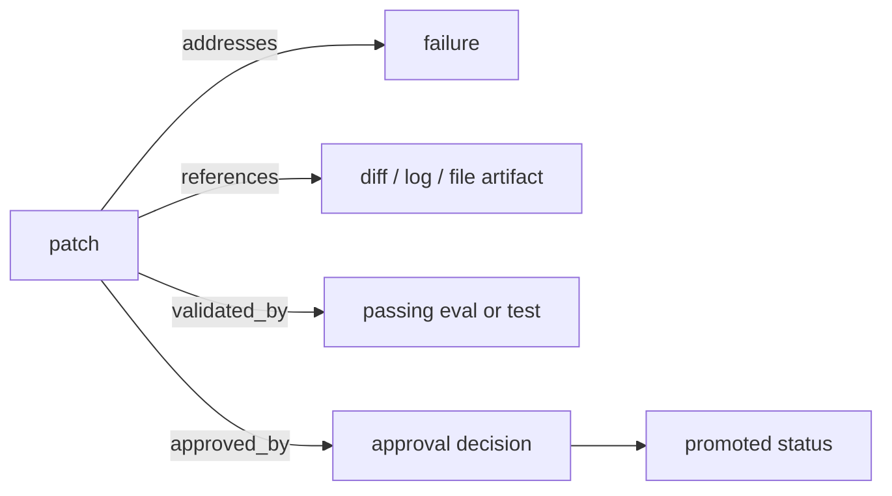

# Patch Lifecycle

A state patch records semantic intent and evidence. It is not a replacement for a Git diff.

The lifecycle is:

```text
proposed -> applied_in_fork -> evaluated -> approved/rejected -> promoted
```



Additional states:

- `stale`
- `conflicted`

The patch should answer:

- what failure it addresses
- what hypothesis or evidence supports it
- what concrete artifact contains the project diff
- what eval validated it
- who or what approved it
- which commit or promotion contains it

Promotion should require evidence such as a passing eval, a passing test, or explicit human approval.


