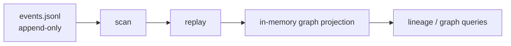

# Persistence Guide

`yoagent-state` ships with two v0 stores:

- `MemoryEventStore`
- `JsonlEventStore`

Both implement the same `EventStore` trait.

## Memory store

Use memory storage for tests and examples:

```rust
let state = YoAgentState::load(MemoryEventStore::new()).await?;
```

Memory state disappears when the process exits.

## JSONL store

Use JSONL when state should survive restart:

```rust
let state = YoAgentState::load(
    JsonlEventStore::new(".yoagent-state/events.jsonl")
).await?;
```

The JSONL store writes one event per line. This makes state easy to inspect, copy, diff, and replay.

## Load means replay

Loading state scans the event log and replays it into the graph:

```text
events.jsonl -> replay -> graph projection
```



The event log is durable. The graph is derived.

## Why JSONL first

JSONL is boring and inspectable. That is useful while the state model is still young.

SQLite is intentionally left for later. It should be added after real usage proves the event shape and query needs.

## Practical advice

- Store important artifacts outside the event log and reference them by URI.
- Hash important diffs, logs, and eval results when possible.
- Keep payloads useful but not huge.
- Treat the event log as append-only.
