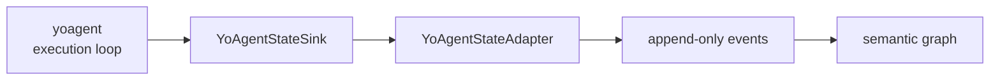
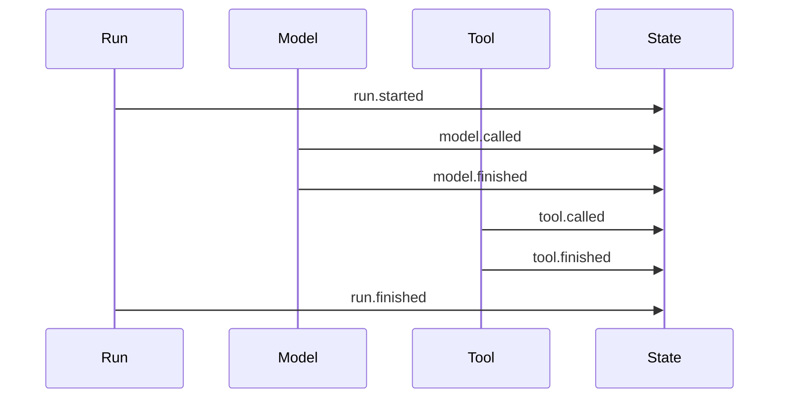

# yoagent Integration

`yoagent-state` should be optional. The agent loop emits events to a sink; the state layer records them and builds lineage.

The boundary is:

```text
yoagent = execution
yoagent-state = state, lineage, patches, evals, decisions
```



## Adapter shape

The crate provides `YoAgentStateSink` and `YoAgentStateAdapter`.

The adapter records:

- run started and finished
- model called and finished
- tool called and finished
- failure observed when a tool finishes unsuccessfully

## Measurement metadata (0.5+)

`YoAgentToolCalled` and `YoAgentModelFinished` carry a free-form
`metadata: JsonValue`, with two canonical uses:

- **`tool.called` → `{"args_fingerprint": ..}`** — a stable identity for the
  call, persisted onto the folded `ToolCall` node. `input_summary` is a
  truncated human summary and cannot be used to match calls; the fingerprint
  can, which is what enables re-fetch ("redo") analysis across a log.
- **`model.finished` → `{"usage": {"input", "output", "cache_read",
  "cache_write"}}`** — token accounting in the raw event. This makes real
  cost computable from the log alone, and makes context compaction
  *inferable*: a sharp drop in input tokens between consecutive model calls
  in one run is the compaction signature, so no dedicated event kind is
  needed.

Events recorded before 0.5 deserialize unchanged (`#[serde(default)]`); old
readers ignore the extra key. yoagent's `gasp` feature fills both fields
automatically from 0.16.

Minimal setup:

```rust
let state = YoAgentState::load(MemoryEventStore::new()).await?;
let sink = YoAgentStateAdapter::new(state, ActorRef::agent("yoagent"));
```

## Run lifecycle

A typical run emits:

```text
run.started
model.called
model.finished
tool.called
tool.finished
run.finished
```



Those events stay historical unless converted into state ops. This keeps the graph projection focused on durable semantic state.

## Example

Run:

```bash
cargo run --example yoagent_integration
```

The example records a short run with model and tool events, then prints the event log as JSON.

## Integration advice

- Keep state recording optional.
- Attach selected tool outputs as artifacts instead of dumping everything into graph nodes.
- Use causation and correlation IDs when connecting model/tool events to a run.
- Convert only meaningful facts into state ops.

The goal is continuity, not a heavier agent runtime.
