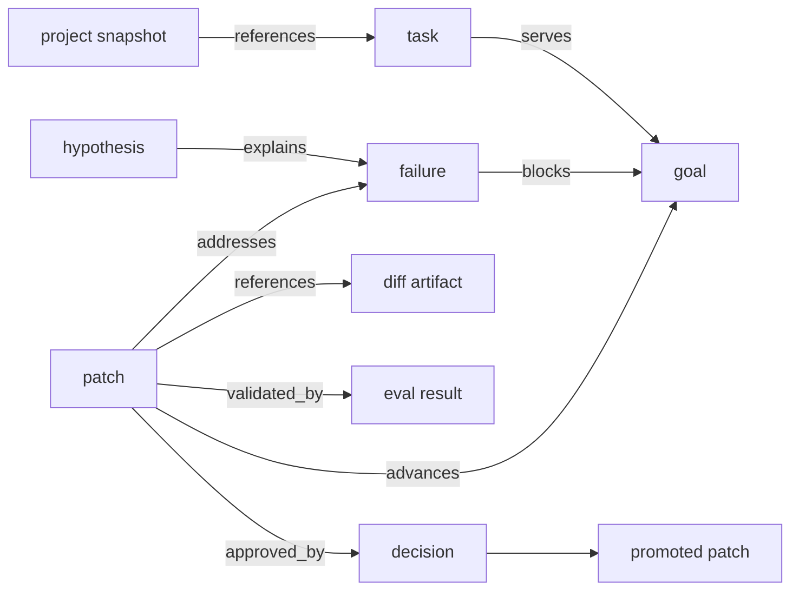
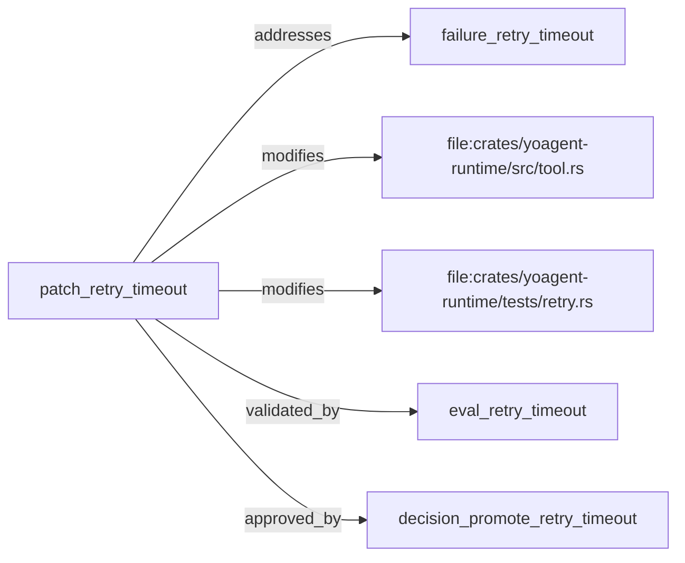

# yoyo evolve Integration

`yoyo evolve` is the first serious use case for `yoagent-state`.

It needs to grow a project while preserving why each change exists.

## Growth loop

The intended loop is:

```text
record goal
create task
observe project
record snapshot reference
run agent task or eval
observe failure
create hypothesis
propose patch
attach artifacts
apply patch in branch or worktree
run eval
record eval result
decide approve or reject
promote if approved
record lineage
```



## What yoagent-state tracks

For a project yoyo is improving, the state layer should track:

- why a module exists
- why a dependency was added
- what goal and task the change served
- what test validates behavior
- what failure caused a patch
- what decision approved it
- what assumptions became stale
- what version introduced behavior

Concrete project diffs remain external. Reference them with `ArtifactRef` and `ProjectRef`.

## Demo

Run:

```bash
cargo run --example yoyo_evolve_demo
```

The demo records:

- a retry failure
- a base project reference
- a diff artifact
- changed file relations
- an eval result
- a human approval decision
- a promoted patch status

The resulting lineage includes:

```text
patch_retry_timeout
addresses -> failure_retry_timeout
modifies -> file:crates/yoagent-runtime/src/tool.rs
modifies -> file:crates/yoagent-runtime/tests/retry.rs
validated_by -> eval_retry_timeout
approved_by -> decision_promote_retry_timeout
```



## Implementation rule

Do not hide mutation.

Every meaningful project change should have:

- a patch
- an artifact reference
- evidence or expected effect
- an eval or approval decision before promotion

That makes yoyo’s project growth inspectable instead of magical.
